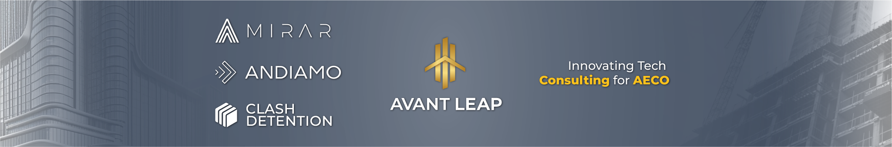

# Avant Leap 

At Avant Leap, our mission is to revolutionize the engineering landscape by providing cutting-edge digital solutions. 🏗️🤖 We empower engineers to achieve excellence through seamless integration of technology, automation, and intelligence. Our commitment is to lead the way in transforming industries, optimizing practices, and creating a sustainable impact on the world. 🚀

We are a team of passionate thinkers and strategists in the building industry. Utilizing cutting-edge technology and innovation, we tackle intricate challenges. Our collaboration with architects, engineers, contractors, and owners ensures optimized project delivery across the entire lifecycle.

## About

We are a team of world-class problem-solvers and innovators. Our expertise spans across various domains of the AECO industry, and we are passionate about providing life-saving solutions that make a real difference in the way projects are executed. 

## Our Mission

Avant Leap's goal is to change the AECO business for the better by using cutting-edge technology and new ideas. Our goal is to improve project management, building, and design so that they are more precise, efficient, and long-lasting.

## Our Values

- **Innovation**
- **Collaboration**
- **Excellence**
- **Sustainability**
- **Responsibility**

## Contact Us

📧 [Email](mailto:info@avantleap.com)

🌐 [Website](https://avantleap.com)

📞 Phones:

- IRVINE: (800) 376-8551
- DUBAI: +971-50-947-5880
- DOHA: +974-50-511055
- SANTO DOMINGO: +(829) 860-8272
- BELGIUM: +32 497 34 34 34 &&  +32 492 20 10 05
